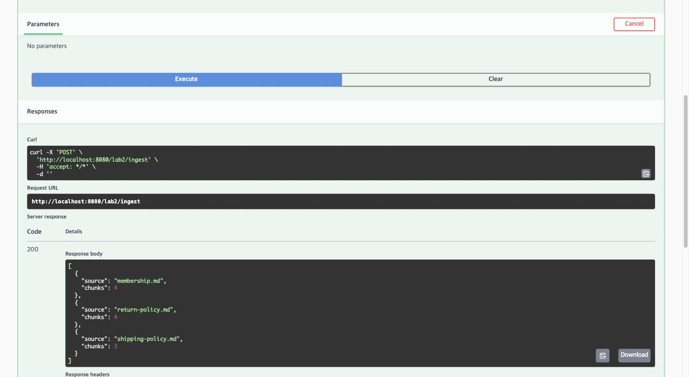
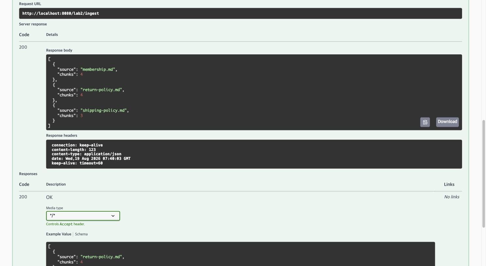
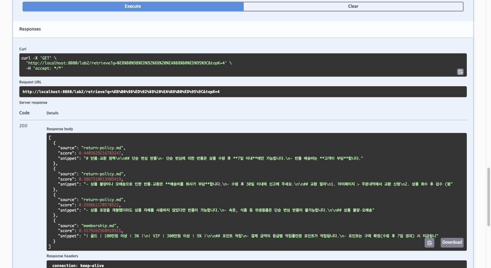
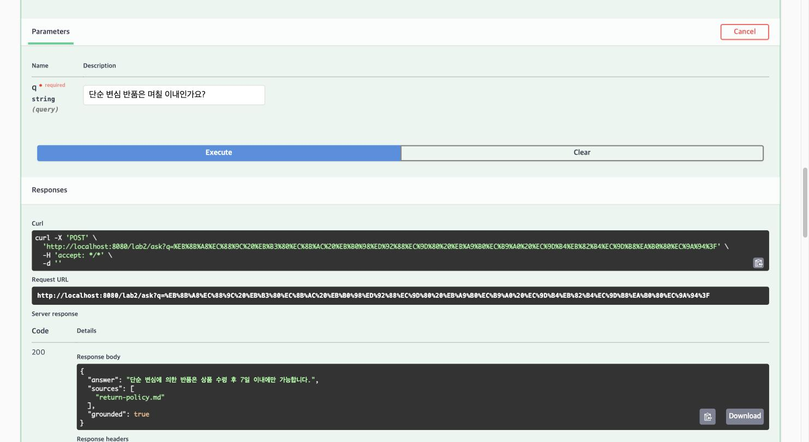
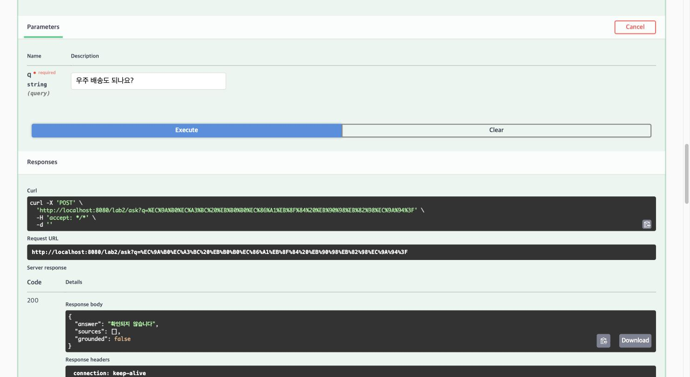

# SpringAI 이해 및 활용 — Day 2 실습과제 결과 보고서

**메인 실습 · 사내 문서 Q&A API (Spring AI VectorStore + RAG + 골든 세트 평가)**

| 항목        | 내용                                                                                       |
| ----------- | ------------------------------------------------------------------------------------------ |
| 조원        | 황재원 (P___) · 박성우 (P___) · 김령아 (P___)                                               |
| 실습 일자   | 2026-08-19 (`hwangjaewon/day2-rag-qna` 브랜치 기준)                                         |
| 산출물 위치 | 이 리포지토리 전체(`사내문서QnA_메인실습/`) — GitHub: <https://github.com/wodnjs2020136144/day2-rag-qna> |

> ⚠️ 이 프로젝트는 세 사람이 **머지하지 않는 별도 브랜치**(`hwangjaewon/day2-rag-qna`,
> `parksungwoo/day2-rag-qna`, `lyoungah-kim/day2-rag-qna`)에서 각자 Step 1~5를 완주한다.
> 이 보고서는 각자 자기 브랜치 기준으로 하나씩 작성하거나(권장), 상의해서 하나로 합쳐도 된다.

---

## 1. 실습 개요

교안 메인 실습(p.219–229) 목표는 사내 규정 문서를 근거로 답하고 출처를 붙이는 RAG API를 완성하는
것이다. 3인 1조가 같은 조건(직접 조립형, `golden.json` 공통)으로 각자 완주한 뒤 확장 과제로
차별화했다.

| 항목            | 내용                                                                                  |
| --------------- | ------------------------------------------------------------------------------------- |
| 엔드포인트      | `POST /lab2/ingest` · `GET /lab2/retrieve` · `POST /lab2/ask`                         |
| 구현 방식       | 직접 조립형 — `similaritySearch` → 근거 포맷팅 → 수동 프롬프트 → `.entity(AnswerDto.class)` |
| 사용 스택       | JDK 21 · Spring Boot 4.1.0 · spring-ai-bom 2.0.0 · SimpleVectorStore(인메모리)          |
| ChatClient 옵션 | temperature = 0.0 · maxTokens = 300 (재현성·비용 상한 고정, `Lab2AiConfig`)             |
| 문서            | return-policy.md · shipping-policy.md · membership.md (3종)                            |

| 담당 | 조원 | 확장 과제 | 축 |
|---|---|---|---|
| A | 황재원 (P___) | _______________ | ☐ 검색 품질  ☐ 운영·보안  ☐ 기타 |
| B | 박성우 (P___) | _______________ | ☐ 검색 품질  ☐ 운영·보안  ☐ 기타 |
| C | 김령아 (P___) | _______________ | ☐ 검색 품질  ☐ 운영·보안  ☐ 기타 |

---

## 2. 자동 테스트 실행 결과

키 없이 도는 웹 계층 스모크 테스트(`Lab2ControllerTest`)를 실행해 통과를 확인한다.

```
$ ./gradlew test

> Task :test
BUILD SUCCESSFUL in 2s
5 actionable tasks: 1 executed, 4 up-to-date

Lab2ControllerTest — 3건 통과 (컨트롤러 위임만 확인, 모델 호출 없음)
Lab2ChunkingTest   — 1건 통과 (청크 수 측정 — Step 5 실험표 해석 근거, 5절 참고)
```

**완료 기준 3번(계층 분리) 기계적 확인:**

```
$ grep -rn "ChatClient\|VectorStore" src/main/java/com/skala/day2/web/
Lab2Controller.java:20: * Day 2 메인 실습 — 3개 엔드포인트. 이 컨트롤러는 {@code ChatClient}·{@code VectorStore}를 모른다
```

유일한 일치는 이 규칙을 설명하는 Javadoc 주석 자체다 — 실제 `import`나 필드 선언은 없다. 컨트롤러는
`Lab2IngestService`·`Lab2QnaService`에만 의존한다.

---

## 3. 완료 기준 8개 실측 (p.229)

각 항목을 실제로 호출해 캡처하거나 응답을 그대로 붙여넣는다.

| # | 확인 항목 | 통과 기준 | 결과 |
|---|---|---|---|
| 1 | 인제스트 | 문서 3종 적재·청크 수를 안다 | ☑ (4/4/3청크, 3-1절) |
| 2 | 검색 확인 | `/lab2/retrieve`로 근거를 눈으로 본다 | ☑ (3-3절) |
| 3 | 출처 표기 | 답변에 출처가 함께 나온다 | ☑ (3-4절) |
| 4 | **거절** | 문서에 없는 질문을 지어내지 않는다 | ☑ (3-5절) |
| 5 | 구조화 응답 | record로 답변·출처·근거여부 반환 | ☑ (`AnswerDto`, 3-4·3-5절) |
| 6 | 평가 | 골든 세트 8/10 이상 | ☑ (9 / 10, 4절) |
| 7 | 실험 | 실험표 A~D를 채웠다 | ☑ (A~F + 채택값 G, 5절) |
| 8 | **재색인** | 두 번 인제스트해도 청크 수가 같다 | ☑ (3-2절) |

### 3-1. 인제스트

`POST /lab2/ingest` — 첫 번째 호출.



```json
[
  { "source": "membership.md", "chunks": 4 },
  { "source": "return-policy.md", "chunks": 4 },
  { "source": "shipping-policy.md", "chunks": 3 }
]
```

### 3-2. 재색인 확인

같은 요청을 한 번 더 호출 — 청크 수가 동일했다.



`Lab2IngestService`가
매 인제스트마다 `vectorStore.delete(filterBuilder.eq("source", source).build())`로 같은 `source`를
먼저 지운 뒤 다시 넣기 때문에, 몇 번을 돌려도 청크가 누적되지 않는다.

| | membership.md | return-policy.md | shipping-policy.md |
|---|---|---|---|
| 1회차 | 4 | 4 | 3 |
| 2회차 | 4 | 4 | 3 |

### 3-3. 검색

`GET /lab2/retrieve?q=반품 기한&topK=4` — 점수·출처·스니펫이 그대로 노출된다.



```json
[
  { "source": "return-policy.md", "score": 0.4404, "snippet": "...단순 변심에 의한 반품은 상품 수령 후 7일 이내에만 가능합니다..." },
  { "source": "return-policy.md", "score": 0.3867, "snippet": "...상품 불량이나 오배송으로 인한 반품·교환은 배송비를 회사가 부담..." },
  { "source": "return-policy.md", "score": 0.3597, "snippet": "...상품 포장을 개봉했더라도 상품 자체를 사용하지 않았다면 반품이 가능..." },
  { "source": "membership.md", "score": 0.3179, "snippet": "...골드 100만원 이상 3% | VIP 300만원 이상 5%..." }
]
```

### 3-4. 정상 답변 + 출처

`POST /lab2/ask?q=단순 변심 반품은 며칠 이내인가요?`



```json
{
  "answer": "단순 변심에 의한 반품은 상품 수령 후 7일 이내에만 가능합니다.",
  "sources": ["return-policy.md"],
  "grounded": true
}
```

### 3-5. 거절 — 오늘의 핵심 학습 지점

`POST /lab2/ask?q=우주 배송도 되나요?`



```json
{
  "answer": "확인되지 않습니다",
  "sources": [],
  "grounded": false
}
```

이 질문은 "배송"이라는 단어가 겹쳐 검색 자체는 근거를 가져온다(evidence는 비어 있지 않다) — 그런데도
거절이 나온 이유는 5절에서 다룬다: 실제 거절 판단은 검색 threshold가 아니라 시스템 프롬프트의
grounded 판단이 맡고 있다.

---

## 4. 골든 세트 평가 (완료 기준 6번)

```
$ ./gradlew test -Peval -Dlab2.rag.chunk-size=120 -Dlab2.rag.min-chunk-size-chars=80

[Step5] 파라미터: Lab2RagProperties[chunkSize=120, minChunkSizeChars=80, overlapRatio=0.0, topK=4, similarityThreshold=0.2]
       / 청크 수: [IngestResult[membership.md, 4], IngestResult[return-policy.md, 4], IngestResult[shipping-policy.md, 3]]
실패: 물건 돌려보내려면 며칠 안에 해야 해요?
 답변: 상품 불량이나 오배송으로 인한 반품은 수령 후 30일 이내에 신고해야 합니다.
 출처: [return-policy.md]
통과 9/10
```

(채택값 120/80 기준. 이 값은 `application.yml`의 `lab2.rag` 기본값이라 인자 없이
`./gradlew test -Peval`만으로도 동일하게 재현된다 — 위 명령은 명시적으로 적은 것뿐이다.)

### 실패 유형 분류

| 문항 | 실패 유형 | 원인 | 조치 |
|---|---|---|---|
| "물건 돌려보내려면 며칠 안에 해야 해요?" (정답: return-policy.md의 "단순 변심 반품" 섹션, 7일) | ㉠ 근거를 못 찾음 | `return-policy.md`가 4청크로 쪼개지면서 "단순 변심 반품"(7일)과 "상품 불량·오배송"(30일) 섹션이 분리됐다. 두 섹션 모두 "반품"·"며칠" 어휘가 겹쳐 벡터 유사도로 구분하기 어렵고, 이번 질의에서는 top-4 안에서 오배송 섹션이 더 높은 순위를 차지해 그쪽을 근거로 답했다. 모델이 근거를 잘못 고른 게 아니라 검색이 정답 섹션을 상위로 못 올린 경우다. | Step 5 실험표(5절)로 청크 크기·topK를 더 키우면 완화될 수 있으나, 이번 코퍼스(문서 3개)로는 청킹 전략 간 차이를 통계적으로 구분할 수 없었다(5절 결론). 확장 과제 HyDE(질문 변환)나 rerank가 근본적인 개선 후보다. |

---

## 5. 실험표 (완료 기준 7번, p.226)

모든 조합은 `scripts/step5-experiment.sh`로 측정했다. 원본 로그·실패 문항은
`docs/step5-실험결과.md` 참고. threshold가 표에 없는 행은 전부 0.2로 고정했다(한 번에 한 변수만
바꿔야 비교가 된다).

| 조합 | 청크 | top-k | 총 청크 수 | top-k가 가져가는 비율 | 통과율 / 관찰한 것 |
|---|---|---|---|---|---|
| A (기준) | 400토큰·겹침 0 | 4 | 3 | **100%** | 10/10 — 검색이 아니라 코퍼스 전체 주입(아래 해석 참고) |
| B (작게) | 200토큰 | 4 | 6 | 67% | 10/10 — 여전히 대부분을 가져가지만 A보다는 선별이 있다 |
| C (크게) | 800토큰 | 4 | 3 | **100%** | 10/10 — A와 동일(청크가 400토큰에서 이미 문서당 1개로 포화) |
| D (넓게) | 400토큰 | 8 | 3 | **100%** | 10/10 — A와 완전히 동일. 청크가 3개뿐이라 top-k를 8로 늘려도 가져올 게 없다 |
| E (엄격) | 400토큰·threshold 0.7 | 4 | 3 | 100%(선별 전) | **1/10** — 9문항 전부 evidence가 비어(`출처: []`) 모델을 부르지도 못하고 "확인되지 않습니다"로 즉답. 정답 근거까지 threshold가 걸러냈다 |
| F (겹침) | 400토큰·겹침 20% | 4 | 3 | **100%** | 10/10 — A와 동일한 이유(청크 3개는 겹침을 붙여도 3개다) |
| G (채택값) | 120토큰·겹침 0 | 4 | **11** | **36%** | **9/10** — 유일하게 검색이 실제로 선별을 수행한 조합(4절 실패 유형 참고) |

**해석 — 실험표를 액면 그대로 읽으면 안 되는 이유.** A·C·D·F가 전부 10/10이라 "큰 청크가 낫다"로
보이지만, 청크 수를 실측(`Lab2ChunkingTest`)해 보면 이 네 조합은 서로 다른 실험이 아니었다. 문서
3개가 각각 400~800토큰 설정에서 1청크로 뭉쳐 코퍼스 전체가 3청크뿐이고, top-k=4는 그 3개를 전부
가져간다 — 즉 "검색"이 아니라 "코퍼스 전체를 프롬프트에 통째로 넣고 gpt-4o-mini가 읽게 한 것"이다.
D가 top-k를 8로 늘려도 A와 숫자가 완전히 같은 게 이를 보여주는 직접적인 증거다(가져올 청크 자체가
3개뿐이므로 top-k를 늘려도 아무 변화가 없다).

검색이 실제로 선택을 수행한 건 **G(11청크 중 4개, 36%)** 하나뿐이다. 선택을 하니 실패도 발생했다 —
9/10의 유일한 실패(4절)는 정답 섹션이 top-4 밖으로 밀린 경우다. 역설적으로 이 9/10이 10/10보다
더 신뢰할 수 있는 숫자다. **결론: 이 코퍼스(문서 3개, 10~30문장)와 골든셋 10문항 규모로는 청킹
전략 간 차이를 통계적으로 구분할 수 없다.** 구분하려면 코퍼스를 늘리거나, `/lab2/ask`의 정답률이
아니라 `/lab2/retrieve`의 순위·점수를 직접 채점하는 검색 전용 지표가 필요하다.

E는 반대쪽에서 같은 사실을 보여준다 — threshold를 높여 "거절을 더 잘 시키자"고 하면 정답 근거까지
전부 걸러 통과율이 1/10로 붕괴한다. 이 프로젝트가 threshold(1차, 낮게)와 시스템 프롬프트의 grounded
판단(2차, 실제 거절 담당)으로 방어선을 나눈 이유가 이 실험으로 실측 확인됐다
(`Lab2QnaService`·`application.yml`의 `lab2.rag.similarity-threshold` 주석 참고).

F(겹침 20%)는 `TokenTextSplitter`(spring-ai 2.0.0)에 겹침 옵션 자체가 없어(`javap`로 확인)
`Lab2IngestService#applyOverlap()`으로 직접 구현한 문자 기준 근사다 — 청크 3개짜리 코퍼스에서는
겹침을 붙여도 청크 수가 그대로라 A와 구분되지 않았다. 겹침의 효과를 재려면 최소 B(200토큰) 이상으로
쪼개진 코퍼스가 필요하다.

**해석(김령아)** A~F 실험에서 A, B, C, D, F는 모두 10/10으로 동일했고, E의 similarity threshold 0.7만 1/10으로 크게 하락했다. 이를 통해 현재처럼 문서 수와 청크 수가 적은 환경에서는 chunk size, top-k, overlap을 변경해도 실제 검색 결과의 차이가 크지 않을 수 있다는 점을 확인했다.
반면 threshold를 과도하게 높이면 무관한 질문만 거르는 것이 아니라 정상 질문의 근거 문서까지 함께 제거할 수 있었다. 실제로 정상 질문의 관련 문서 similarity score도 약 0.25~0.44 수준이었기 때문에, threshold 0.7은 지나치게 엄격한 조건이었다.
또한 우주 배송처럼 문서에 답이 없는 질문도 배송 문서와 비교적 높은 유사도를 보였기 때문에, 유사도 점수가 높다는 것만으로 실제 답변 근거가 존재한다고 판단할 수 없다는 점도 확인했다.
따라서 이번 실험을 통해 RAG의 검색 파라미터는 임의로 크게 또는 엄격하게 설정하는 것이 아니라, 실제 검색 score와 평가 결과를 함께 확인하면서 조정해야 한다고 판단했다. 또한 검색 결과를 그대로 답변에 사용하는 것보다, 검색된 근거 안에 실제 답이 존재하는지를 다시 검증하는 과정이 중요하다고 생각한다.

---

## 6. 확장 과제 — 전후 비교

| 담당 | 확장 과제 | 붙이기 전 통과율 | 붙인 후 통과율 | 채택 여부 | 배운 것 |
|---|---|---|---|---|---|
| A | | ___/10 | ___/10 | ☐ 채택  ☐ 되돌림 | |
| B | | ___/10 | ___/10 | ☐ 채택  ☐ 되돌림 | |
| C | | ___/10 | ___/10 | ☐ 채택  ☐ 되돌림 | |

---

## 7. 다른 브랜치 재현 결과 (협업 경험)

완주 후 다른 사람의 브랜치를 체크아웃해 자기 손으로 돌려본 결과. 같은 `golden.json`인데 통과율이
다르다면 원인을 판다(모델 비결정성? 청킹 파라미터? 프롬프트 문구?). 세 명이니 서로 겹치지 않게
최소 한 명씩은 나눠서 재현한다(예: A→B, B→C, C→A).

| 재현 대상 | 원래 통과율 | 재현한 통과율 | 차이 원인 |
|---|---|---|---|
| B의 브랜치를 A가 재현 | ___/10 | ___/10 | |
| C의 브랜치를 B가 재현 | ___/10 | ___/10 | |
| A의 브랜치를 C가 재현 | ___/10 | ___/10 | |

---

## 8. 회고

- **이번 실습에서 새로 배운 것**: 측정 없이 추론만으로 파라미터를 튜닝하면 틀린 결론에 도달할 수
  있다는 것을, 두 단계에 걸쳐 직접 겪었다. 1단계 — "우주 배송" 같은 무관한 질문의 오탐 점수(0.45)를
  근거로 청크를 400→120으로 잘게 쪼갰는데, Step 5에서 실측해 보니 그 근거는 통과율과 무관했다.
  2단계 — 실측 숫자(A 10/10 vs G 9/10)마저 액면 그대로 읽으면 "청크를 쪼갠 게 오히려 나빴다"는
  또 다른 틀린 결론에 도달했고, 청크 수를 직접 세고 나서야("A~D·F는 검색이 아니라 전체 주입이었다")
  진짜 원인이 보였다. **지표가 오르거나 내리면, 왜 그런지부터 의심한다**는 게 이번 실습의 핵심
  교훈이다.
- **가장 막혔던 지점과 해결 과정**: 완료 기준 4번(거절)을 검색 threshold만으로 만들려 했던 시도가
  두 번 막혔다 — 처음엔 threshold(0.5)가 너무 높아 정답까지 검색이 안 됐고, 낮춘 뒤에는 정답·오답
  점수대가 겹쳐 threshold로 분리가 안 됐다(3-5절). Step 5의 E 조합(threshold 0.7, 1/10)이 이 실패를
  다시 재현해 확증했다. 해결은 역할을 나누는 것이었다 — threshold는 "점수가 완전히 바닥인 질문만
  거르는 느슨한 1차 방어선"으로 낮게 두고, 실제 거절 판단은 시스템 프롬프트의 grounded 판단(2차
  방어선)에 맡겼다.
- **다음에 다르게 해볼 것**: 파라미터를 바꾸기 전에 먼저 "이 변경이 실제로 검색 결과에 영향을 줄
  수 있는 상황인가"부터 확인한다(이번엔 청크 수를 재는 것만으로 충분했다). 코퍼스가 작을 때는
  golden.json 통과율만으로 검색 전략을 비교하지 않는다 — `/lab2/retrieve`의 순위 자체를 채점하는
  검색 전용 지표나, 더 큰(또는 더 다양한) 코퍼스가 있어야 A~F 같은 실험이 의미를 가진다.
